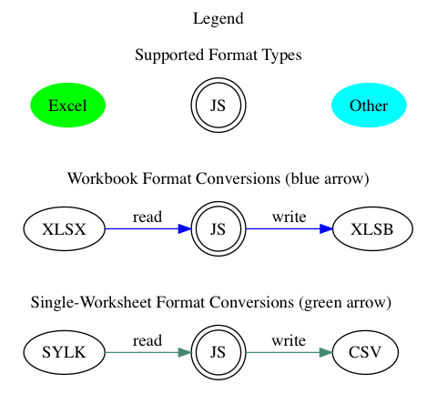

# [SheetJS js-xlsx](http://sheetjs.com)

Parser and writer for various spreadsheet formats.  Pure-JS cleanroom
implementation from official specifications, related documents, and test files.
Emphasis on parsing and writing robustness, cross-format feature compatibility
with a unified JS representation, and ES3/ES5 browser compatibility back to IE6.

This is the community version.  We also offer a pro version with performance
enhancements, additional features like styling, and dedicated support.


[**Pro Version**](http://sheetjs.com/pro)

[**Commercial Support**](http://sheetjs.com/support)

[**Rendered Documentation**](http://docs.sheetjs.com/)

[**In-Browser Demos**](http://sheetjs.com/demos)

[**Source Code**](http://git.io/xlsx)

[**Issues and Bug Reports**](https://github.com/sheetjs/sheetjs/issues)

[**File format support for known spreadsheet data formats:**](#file-formats)

<details>
  <summary><b>Graph of supported formats</b> (click to show)</summary>




</details>

[**Browser Test**](http://oss.sheetjs.com/sheetjs/tests/)

[](https://saucelabs.com/u/sheetjs)

[](https://travis-ci.org/SheetJS/sheetjs)
[](https://semaphoreci.com/sheetjs/sheetjs)
[](https://coveralls.io/r/SheetJS/sheetjs?branch=master)
[](https://david-dm.org/sheetjs/sheetjs)
[](https://npmjs.org/package/xlsx)
[](https://github.com/SheetJS/sheetjs)

## Table of Contents

<details>
  <summary><b>Expand to show Table of Contents</b></summary>

<!-- toc -->

- [Installation](#installation)
  * [JS Ecosystem Demos](#js-ecosystem-demos)
  * [Optional Modules](#optional-modules)
  * [ECMAScript 5 Compatibility](#ecmascript-5-compatibility)
- [Philosophy](#philosophy)
- [Parsing Workbooks](#parsing-workbooks)
  * [Parsing Examples](#parsing-examples)
  * [Streaming Read](#streaming-read)
- [Working with the Workbook](#working-with-the-workbook)
  * [Parsing and Writing Examples](#parsing-and-writing-examples)
- [Writing Workbooks](#writing-workbooks)
  * [Writing Examples](#writing-examples)
  * [Streaming Write](#streaming-write)
- [Interface](#interface)
  * [Parsing functions](#parsing-functions)
  * [Writing functions](#writing-functions)
  * [Utilities](#utilities)
- [Common Spreadsheet Format](#common-spreadsheet-format)
  * [General Structures](#general-structures)
  * [Cell Object](#cell-object)
    + [Data Types](#data-types)
    + [Dates](#dates)
  * [Sheet Objects](#sheet-objects)
    + [Worksheet Object](#worksheet-object)
    + [Chartsheet Object](#chartsheet-object)
    + [Macrosheet Object](#macrosheet-object)
    + [Dialogsheet Object](#dialogsheet-object)
  * [Workbook Object](#workbook-object)
    + [Workbook File Properties](#workbook-file-properties)
  * [Workbook-Level Attributes](#workbook-level-attributes)
    + [Defined Names](#defined-names)
    + [Workbook Views](#workbook-views)
    + [Miscellaneous Workbook Properties](#miscellaneous-workbook-properties)
  * [Document Features](#document-features)
    + [Formulae](#formulae)
    + [Column Properties](#column-properties)
    + [Row Properties](#row-properties)
    + [Number Formats](#number-formats)
    + [Hyperlinks](#hyperlinks)
    + [Cell Comments](#cell-comments)
    + [Sheet Visibility](#sheet-visibility)
    + [VBA and Macros](#vba-and-macros)
- [Parsing Options](#parsing-options)
  * [Input Type](#input-type)
  * [Guessing File Type](#guessing-file-type)
- [Writing Options](#writing-options)
  * [Supported Output Formats](#supported-output-formats)
  * [Output Type](#output-type)
- [Utility Functions](#utility-functions)
  * [Array of Arrays Input](#array-of-arrays-input)
  * [Array of Objects Input](#array-of-objects-input)
  * [HTML Table Input](#html-table-input)
  * [Formulae Output](#formulae-output)
  * [Delimiter-Separated Output](#delimiter-separated-output)
    + [UTF-16 Unicode Text](#utf-16-unicode-text)
  * [HTML Output](#html-output)
  * [JSON](#json)
- [File Formats](#file-formats)
  * [Excel 2007+ XML (XLSX/XLSM)](#excel-2007-xml-xlsxxlsm)
  * [Excel 2.0-95 (BIFF2/BIFF3/BIFF4/BIFF5)](#excel-20-95-biff2biff3biff4biff5)
  * [Excel 97-2004 Binary (BIFF8)](#excel-97-2004-binary-biff8)
  * [Excel 2003-2004 (SpreadsheetML)](#excel-2003-2004-spreadsheetml)
  * [Excel 2007+ Binary (XLSB, BIFF12)](#excel-2007-binary-xlsb-biff12)
  * [Delimiter-Separated Values (CSV/TXT)](#delimiter-separated-values-csvtxt)
  * [Other Workbook Formats](#other-workbook-formats)
    + [Lotus 1-2-3 (WKS/WK1/WK2/WK3/WK4/123)](#lotus-1-2-3-wkswk1wk2wk3wk4123)
    + [Quattro Pro (WQ1/WQ2/WB1/WB2/WB3/QPW)](#quattro-pro-wq1wq2wb1wb2wb3qpw)
    + [OpenDocument Spreadsheet (ODS/FODS)](#opendocument-spreadsheet-odsfods)
    + [Uniform Office Spreadsheet (UOS1/2)](#uniform-office-spreadsheet-uos12)
  * [Other Single-Worksheet Formats](#other-single-worksheet-formats)
    + [dBASE and Visual FoxPro (DBF)](#dbase-and-visual-foxpro-dbf)
    + [Symbolic Link (SYLK)](#symbolic-link-sylk)
    + [Lotus Formatted Text (PRN)](#lotus-formatted-text-prn)
    + [Data Interchange Format (DIF)](#data-interchange-format-dif)
    + [HTML](#html)
    + [Rich Text Format (RTF)](#rich-text-format-rtf)
    + [Ethercalc Record Format (ETH)](#ethercalc-record-format-eth)
- [Testing](#testing)
  * [Node](#node)
  * [Browser](#browser)
  * [Tested Environments](#tested-environments)
  * [Test Files](#test-files)
- [Contributing](#contributing)
  * [OSX/Linux](#osxlinux)
  * [Windows](#windows)
  * [Tests](#tests)
- [License](#license)
- [References](#references)

<!-- tocstop -->

</details>

## Installation

In the browser, just add a script tag:

```html
<script lang="javascript" src="dist/xlsx.full.min.js"></script>
```

<details>
  <summary><b>CDN Availability</b> (click to show)</summary>

|    CDN     | URL                                        |
|-----------:|:-------------------------------------------|
|    `unpkg` | <https://unpkg.com/xlsx/>                  |
| `jsDelivr` | <https://jsdelivr.com/package/npm/xlsx>    |
|    `CDNjs` | <http://cdnjs.com/libraries/xlsx>          |
|    `packd` | <https://bundle.run/xlsx@latest?name=XLSX> |

`unpkg` makes the latest version available at:

```html
<script src="https://unpkg.com/xlsx/dist/xlsx.full.min.js"></script>
```

</details>


With [npm](https://www.npmjs.org/package/xlsx):

```bash
$ npm install xlsx
```

With [bower](http://bower.io/search/?q=js-xlsx):

```bash
$ bower install js-xlsx
```

### JS Ecosystem Demos

The [`demos` directory](demos/) includes sample projects for:

**Frameworks and APIs**
- [`angularjs`](demos/angular/)
- [`angular 2 / 4 / 5 / 6 and ionic`](demos/angular2/)
- [`knockout`](demos/knockout/)
- [`meteor`](demos/meteor/)
- [`react and react-native`](demos/react/)
- [`vue 2.x and weex`](demos/vue/)
- [`XMLHttpRequest and fetch`](demos/xhr/)
- [`nodejs server`](demos/server/)
- [`databases and key/value stores`](demos/database/)
- [`typed arrays and math`](demos/array/)

**Bundlers and Tooling**
- [`browserify`](demos/browserify/)
- [`fusebox`](demos/fusebox/)
- [`parcel`](demos/parcel/)
- [`requirejs`](demos/requirejs/)
- [`rollup`](demos/rollup/)
- [`systemjs`](demos/systemjs/)
- [`typescript`](demos/typescript/)
- [`webpack 2.x`](demos/webpack/)

**Platforms and Integrations**
- [`electron application`](demos/electron/)
- [`nw.js application`](demos/nwjs/)
- [`Chrome / Chromium extensions`](demos/chrome/)
- [`Adobe ExtendScript`](demos/extendscript/)
- [`Headless Browsers`](demos/headless/)
- [`canvas-datagrid`](demos/datagrid/)
- [`x-spreadsheet`](demos/xspreadsheet/)
- [`Swift JSC and other engines`](demos/altjs/)
- [`"serverless" functions`](demos/function/)
- [`internet explorer`](demos/oldie/)

Other examples are included in the [showcase](demos/showcase/).

### Optional Modules

<details>
  <summary><b>Optional features</b> (click to show)</summary>

The node version automatically requires modules for additional features.  Some
of these modules are rather large in size and are only needed in special
circumstances, so they do not ship with the core.  For browser use, they must
be included directly:

```html
<!-- international support from js-codepage -->
<script src="dist/cpexcel.js"></script>
```

An appropriate version for each dependency is included in the dist/ directory.

The complete single-file version is generated at `dist/xlsx.full.min.js`

A slimmer build with XLSX / HTML support is generated at `dist/xlsx.mini.min.js`

Webpack and Browserify builds include optional modules by default.  Webpack can
be configured to remove support with `resolve.alias`:

```js
  /* uncomment the lines below to remove support */
  resolve: {
    alias: { "./dist/cpexcel.js": "" } // <-- omit international support
  }
```

</details>

### ECMAScript 5 Compatibility

Since the library uses functions like `Array#forEach`, older browsers require
[shims to provide missing functions](http://oss.sheetjs.com/js-xlsx/shim.js).

To use the shim, add the shim before the script tag that loads `xlsx.js`:

```html
<!-- add the shim first -->
<script type="text/javascript" src="shim.min.js"></script>
<!-- after the shim is referenced, add the library -->
<script type="text/javascript" src="xlsx.full.min.js"></script>
```

The script also includes `IE_LoadFile` and `IE_SaveFile` for loading and saving
files in Internet Explorer versions 6-9.  The `xlsx.extendscript.js` script
bundles the shim in a format suitable for Photoshop and other Adobe products.

## Philosophy

<details>
  <summary><b>Philosophy</b> (click to show)</summary>

Prior to SheetJS, APIs for processing spreadsheet files were format-specific.
Third-party libraries either supported one format, or they involved a separate
set of classes for each supported file type.  Even though XLSB was introduced in
Excel 2007, nothing outside of SheetJS or Excel supported the format.

To promote a format-agnostic view, js-xlsx starts from a pure-JS representation
that we call the ["Common Spreadsheet Format"](#common-spreadsheet-format).
Emphasizing a uniform object representation enables new features like format
conversion (reading an XLSX template and saving as XLS) and circumvents the mess
of classes.  By abstracting the complexities of the various formats, tools
need not worry about the specific file type!

A simple object representation combined with careful coding practices enables
use cases in older browsers and in alternative environments like ExtendScript
and Web Workers. It is always tempting to use the latest and greatest features,
but they tend to require the latest versions of browsers, limiting usability.

Utility functions capture common use cases like generating JS objects or HTML.
Most simple operations should only require a few lines of code.  More complex
operations generally should be straightforward to implement.

Excel pushes the XLSX format as default starting in Excel 2007.  However, there
are other formats with more appealing properties.  For example, the XLSB format
is spiritually similar to XLSX but files often tend up taking less than half the
space and open much faster!  Even though an XLSX writer is available, other
format writers are available so users can take advantage of the unique
characteristics of each format.

The primary focus of the Community Edition is correct data interchange, focused
on extracting data from any compatible data representation and exporting data in
various formats suitable for any third party interface.

</details>

## Parsing Workbooks

For parsing, the first step is to read the file.  This involves acquiring the
data and feeding it into the library.  Here are a few common scenarios:

<details>
  <summary><b>nodejs read a file</b> (click to show)</summary>

`readFile` is only available in server environments. Browsers have no API for
reading arbitrary files given a path, so another strategy must be used.

```js
if(typeof require !== 'undefined') XLSX = require('xlsx');
var workbook = XLSX.readFile('test.xlsx');
/* DO SOMETHING WITH workbook HERE */
```

</details>

<details>
  <summary><b>Photoshop ExtendScript read a file</b> (click to show)</summary>

`readFile` wraps the `File` logic in Photoshop and other ExtendScript targets.
The specified path should be an absolute path:

```js
#include "xlsx.extendscript.js"
/* Read test.xlsx from the Documents folder */
var workbook = XLSX.readFile(Folder.myDocuments + '/' + 'test.xlsx');
/* DO SOMETHING WITH workbook HERE */
```

The [`extendscript` demo](demos/extendscript/) includes a more complex example.

</details>

<details>
  <summary><b>Browser read TABLE element from page</b> (click to show)</summary>

The `table_to_book` and `table_to_sheet` utility functions take a DOM TABLE
element and iterate through the child nodes.

```js
var workbook = XLSX.utils.table_to_book(document.getElementById('tableau'));
/* DO SOMETHING WITH workbook HERE */
```

Multiple tables on a web page can be converted to individual worksheets:

```js
/* create new workbook */
var workbook = XLSX.utils.book_new();

/* convert table 'table1' to worksheet named "Sheet1" */
var ws1 = XLSX.utils.table_to_sheet(document.getElementById('table1'));
XLSX.utils.book_append_sheet(workbook, ws1, "Sheet1");

/* convert table 'table2' to worksheet named "Sheet2" */
var ws2 = XLSX.utils.table_to_sheet(document.getElementById('table2'));
XLSX.utils.book_append_sheet(workbook, ws2, "Sheet2");

/* workbook now has 2 worksheets */
```

Alternatively, the HTML code can be extracted and parsed:

```js
var htmlstr = document.getElementById('tableau').outerHTML;
var workbook = XLSX.read(htmlstr, {type:'string'});
```

</details>

<details>
  <summary><b>Browser download file (ajax)</b> (click to show)</summary>

Note: for a more complete example that works in older browsers, check the demo
at <http://oss.sheetjs.com/js-xlsx/ajax.html>.  The [`xhr` demo](demos/xhr/)
includes more examples with `XMLHttpRequest` and `fetch`.

```js
var url = "http://oss.sheetjs.com/test_files/formula_stress_test.xlsx";

/* set up async GET request */
var req = new XMLHttpRequest();
req.open("GET", url, true);
req.responseType = "arraybuffer";

req.onload = function(e) {
  var data = new Uint8Array(req.response);
  var workbook = XLSX.read(data, {type:"array"});

  /* DO SOMETHING WITH workbook HERE */
}

req.send();
```

</details>

<details>
  <summary><b>Browser drag-and-drop</b> (click to show)</summary>

Drag-and-drop uses the HTML5 `FileReader` API.

```js
function handleDrop(e) {
  e.stopPropagation(); e.preventDefault();
  var files = e.dataTransfer.files, f = files[0];
  var reader = new FileReader();
  reader.onload = function(e) {
    var data = new Uint8Array(e.target.result);
    var workbook = XLSX.read(data, {type: 'array'});

    /* DO SOMETHING WITH workbook HERE */
  };
  reader.readAsArrayBuffer(f);
}
drop_dom_element.addEventListener('drop', handleDrop, false);
```

</details>

<details>
  <summary><b>Browser file upload form element</b> (click to show)</summary>

Data from file input elements can be processed using the same `FileReader` API
as in the drag-and-drop example:

```js
function handleFile(e) {
  var files = e.target.files, f = files[0];
  var reader = new FileReader();
  reader.onload = function(e) {
    var data = new Uint8Array(e.target.result);
    var workbook = XLSX.read(data, {type: 'array'});

    /* DO SOMETHING WITH workbook HERE */
  };
  reader.readAsArrayBuffer(f);
}
input_dom_element.addEventListener('change', handleFile, false);
```

The [`oldie` demo](demos/oldie/) shows an IE-compatible fallback scenario.

</details>

More specialized cases, including mobile app file processing, are covered in the
[included demos](demos/)

### Parsing Examples

- <http://oss.sheetjs.com/js-xlsx/> HTML5 File API / Base64 Text / Web Workers

Note that older versions of IE do not support HTML5 File API, so the Base64 mode
is used for testing.

<details>
  <summary><b>Get Base64 encoding on OSX / Windows</b> (click to show)</summary>

On OSX you can get the Base64 encoding with:

```bash
$ <target_file base64 | pbcopy
```

On Windows XP and up you can get the Base64 encoding using `certutil`:

```cmd
> certutil -encode target_file target_file.b64
```

(note: You have to open the file and remove the header and footer lines)

</details>

- <http://oss.sheetjs.com/js-xlsx/ajax.html> XMLHttpRequest

### Streaming Read

<details>
  <summary><b>Why is there no Streaming Read API?</b> (click to show)</summary>

The most common and interesting formats (XLS, XLSX/M, XLSB, ODS) are ultimately
ZIP or CFB containers of files.  Neither format puts the directory structure at
the beginning of the file: ZIP files place the Central Directory records at the
end of the logical file, while CFB files can place the storage info anywhere in
the file! As a result, to properly handle these formats, a streaming function
would have to buffer the entire file before commencing.  That belies the
expectations of streaming, so we do not provide any streaming read API.

</details>

When dealing with Readable Streams, the easiest approach is to buffer the stream
and process the whole thing at the end.  This can be done with a temporary file
or by explicitly concatenating the stream:

<details>
  <summary><b>Explicitly concatenating streams</b> (click to show)</summary>

```js
var fs = require('fs');
var XLSX = require('xlsx');
function process_RS(stream/*:ReadStream*/, cb/*:(wb:Workbook)=>void*/)/*:void*/{
  var buffers = [];
  stream.on('data', function(data) { buffers.push(data); });
  stream.on('end', function() {
    var buffer = Buffer.concat(buffers);
    var workbook = XLSX.read(buffer, {type:"buffer"});

    /* DO SOMETHING WITH workbook IN THE CALLBACK */
    cb(workbook);
  });
}
```

More robust solutions are available using modules like `concat-stream`.

</details>

<details>
  <summary><b>Writing to filesystem first</b> (click to show)</summary>

This example uses [`tempfile`](https://npm.im/tempfile) to generate file names:

```js
var fs = require('fs'), tempfile = require('tempfile');
var XLSX = require('xlsx');
function process_RS(stream/*:ReadStream*/, cb/*:(wb:Workbook)=>void*/)/*:void*/{
  var fname = tempfile('.sheetjs');
  console.log(fname);
  var ostream = fs.createWriteStream(fname);
  stream.pipe(ostream);
  ostream.on('finish', function() {
    var workbook = XLSX.readFile(fname);
    fs.unlinkSync(fname);

    /* DO SOMETHING WITH workbook IN THE CALLBACK */
    cb(workbook);
  });
}
```

</details>

## Working with the Workbook

The full object format is described later in this README.

<details>
  <summary><b>Reading a specific cell </b> (click to show)</summary>

This example extracts the value stored in cell A1 from the first worksheet:

```js
var first_sheet_name = workbook.SheetNames[0];
var address_of_cell = 'A1';

/* Get worksheet */
var worksheet = workbook.Sheets[first_sheet_name];

/* Find desired cell */
var desired_cell = worksheet[address_of_cell];

/* Get the value */
var desired_value = (desired_cell ? desired_cell.v : undefined);
```

</details>

<details>
  <summary><b>Adding a new worksheet to a workbook</b> (click to show)</summary>

This example uses [`XLSX.utils.aoa_to_sheet`](#array-of-arrays-input) to make a
sheet and `XLSX.utils.book_append_sheet` to append the sheet to the workbook:

```js
var ws_name = "SheetJS";

/* make worksheet */
var ws_data = [
  [ "S", "h", "e", "e", "t", "J", "S" ],
  [  1 ,  2 ,  3 ,  4 ,  5 ]
];
var ws = XLSX.utils.aoa_to_sheet(ws_data);

/* Add the worksheet to the workbook */
XLSX.utils.book_append_sheet(wb, ws, ws_name);
```

</details>

<details>
  <summary><b>Creating a new workbook from scratch</b> (click to show)</summary>

The workbook object contains a `SheetNames` array of names and a `Sheets` object
mapping sheet names to sheet objects. The `XLSX.utils.book_new` utility function
creates a new workbook object:

```js
/* create a new blank workbook */
var wb = XLSX.utils.book_new();
```

The new workbook is blank and contains no worksheets. The write functions will
error if the workbook is empty.

</details>


### Parsing and Writing Examples

- <http://sheetjs.com/demos/modify.html> read + modify + write files

- <https://github.com/SheetJS/js-xlsx/blob/master/bin/xlsx.njs> node

The node version installs a command line tool `xlsx` which can read spreadsheet
files and output the contents in various formats.  The source is available at
`xlsx.njs` in the bin directory.

Some helper functions in `XLSX.utils` generate different views of the sheets:

- `XLSX.utils.sheet_to_csv` generates CSV
- `XLSX.utils.sheet_to_txt` generates UTF16 Formatted Text
- `XLSX.utils.sheet_to_html` generates HTML
- `XLSX.utils.sheet_to_json` generates an array of objects
- `XLSX.utils.sheet_to_formulae` generates a list of formulae

## Writing Workbooks

For writing, the first step is to generate output data.  The helper functions
`write` and `writeFile` will produce the data in various formats suitable for
dissemination.  The second step is to actual share the data with the end point.
Assuming `workbook` is a workbook object:

<details>
  <summary><b>nodejs write a file</b> (click to show)</summary>

`XLSX.writeFile` uses `fs.writeFileSync` in server environments:

```js
if(typeof require !== 'undefined') XLSX = require('xlsx');
/* output format determined by filename */
XLSX.writeFile(workbook, 'out.xlsb');
/* at this point, out.xlsb is a file that you can distribute */
```

</details>

<details>
  <summary><b>Photoshop ExtendScript write a file</b> (click to show)</summary>

`writeFile` wraps the `File` logic in Photoshop and other ExtendScript targets.
The specified path should be an absolute path:

```js
#include "xlsx.extendscript.js"
/* output format determined by filename */
XLSX.writeFile(workbook, 'out.xlsx');
/* at this point, out.xlsx is a file that you can distribute */
```

The [`extendscript` demo](demos/extendscript/) includes a more complex example.

</details>

<details>
  <summary><b>Browser add TABLE element to page</b> (click to show)</summary>

The `sheet_to_html` utility function generates HTML code that can be added to
any DOM element.

```js
var worksheet = workbook.Sheets[workbook.SheetNames[0]];
var container = document.getElementById('tableau');
container.innerHTML = XLSX.utils.sheet_to_html(worksheet);
```

</details>

<details>
  <summary><b>Browser upload file (ajax)</b> (click to show)</summary>

A complete example using XHR is [included in the XHR demo](demos/xhr/), along
with examples for fetch and wrapper libraries.  This example assumes the server
can handle Base64-encoded files (see the demo for a basic nodejs server):

```js
/* in this example, send a base64 string to the server */
var wopts = { bookType:'xlsx', bookSST:false, type:'base64' };

var wbout = XLSX.write(workbook,wopts);

var req = new XMLHttpRequest();
req.open("POST", "/upload", true);
var formdata = new FormData();
formdata.append('file', 'test.xlsx'); // <-- server expects `file` to hold name
formdata.append('data', wbout); // <-- `data` holds the base64-encoded data
req.send(formdata);
```

</details>

<details>
  <summary><b>Browser save file</b> (click to show)</summary>

`XLSX.writeFile` wraps a few techniques for triggering a file save:

- `URL` browser API creates an object URL for the file, which the library uses
  by creating a link and forcing a click. It is supported in modern browsers.
- `msSaveBlob` is an IE10+ API for triggering a file save.
- `IE_FileSave` uses VBScript and ActiveX to write a file in IE6+ for Windows
  XP and Windows 7.  The shim must be included in the containing HTML page.

There is no standard way to determine if the actual file has been downloaded.

```js
/* output format determined by filename */
XLSX.writeFile(workbook, 'out.xlsb');
/* at this point, out.xlsb will have been downloaded */
```

</details>

<details>
  <summary><b>Browser save file (compatibility)</b> (click to show)</summary>

`XLSX.writeFile` techniques work for most modern browsers as well as older IE.
For much older browsers, there are workarounds implemented by wrapper libraries.

[`FileSaver.js`](https://github.com/eligrey/FileSaver.js/) implements `saveAs`.
Note: `XLSX.writeFile` will automatically call `saveAs` if available.

```js
/* bookType can be any supported output type */
var wopts = { bookType:'xlsx', bookSST:false, type:'array' };

var wbout = XLSX.write(workbook,wopts);

/* the saveAs call downloads a file on the local machine */
saveAs(new Blob([wbout],{type:"application/octet-stream"}), "test.xlsx");
```

[`Downloadify`](https://github.com/dcneiner/downloadify) uses a Flash SWF button
to generate local files, suitable for environments where ActiveX is unavailable:

```js
Downloadify.create(id,{
	/* other options are required! read the downloadify docs for more info */
	filename: "test.xlsx",
	data: function() { return XLSX.write(wb, {bookType:"xlsx", type:'base64'}); },
	append: false,
	dataType: 'base64'
});
```

The [`oldie` demo](demos/oldie/) shows an IE-compatible fallback scenario.

</details>

The [included demos](demos/) cover mobile apps and other special deployments.

### Writing Examples

- <http://sheetjs.com/demos/table.html> exporting an HTML table
- <http://sheetjs.com/demos/writexlsx.html> generates a simple file

### Streaming Write

The streaming write functions are available in the `XLSX.stream` object.  They
take the same arguments as the normal write functions but return a Readable
Stream.  They are only exposed in NodeJS.

- `XLSX.stream.to_csv` is the streaming version of `XLSX.utils.sheet_to_csv`.
- `XLSX.stream.to_html` is the streaming version of `XLSX.utils.sheet_to_html`.
- `XLSX.stream.to_json` is the streaming version of `XLSX.utils.sheet_to_json`.

<details>
  <summary><b>nodejs convert to CSV and write file</b> (click to show)</summary>

```js
var output_file_name = "out.csv";
var stream = XLSX.stream.to_csv(worksheet);
stream.pipe(fs.createWriteStream(output_file_name));
```

</details>

<details>
  <summary><b>nodejs write JSON stream to screen</b> (click to show)</summary>

```js
/* to_json returns an object-mode stream */
var stream = XLSX.stream.to_json(worksheet, {raw:true});

/* the following stream converts JS objects to text via JSON.stringify */
var conv = new Transform({writableObjectMode:true});
conv._transform = function(obj, e, cb){ cb(null, JSON.stringify(obj) + "\n"); };

stream.pipe(conv); conv.pipe(process.stdout);
```

</details>

<https://github.com/sheetjs/sheetaki> pipes write streams to nodejs response.

## Interface

`XLSX` is the exposed variable in the browser and the exported node variable

`XLSX.version` is the version of the library (added by the build script).

`XLSX.SSF` is an embedded version of the [format library](http://git.io/ssf).

### Parsing functions

`XLSX.read(data, read_opts)` attempts to parse `data`.

`XLSX.readFile(filename, read_opts)` attempts to read `filename` and parse.

Parse options are described in the [Parsing Options](#parsing-options) section.

### Writing functions

`XLSX.write(wb, write_opts)` attempts to write the workbook `wb`

`XLSX.writeFile(wb, filename, write_opts)` attempts to write `wb` to `filename`.
In browser-based environments, it will attempt to force a client-side download.

`XLSX.writeFileAsync(filename, wb, o, cb)` attempts to write `wb` to `filename`.
If `o` is omitted, the writer will use the third argument as the callback.

`XLSX.stream` contains a set of streaming write functions.

Write options are described in the [Writing Options](#writing-options) section.

### Utilities

Utilities are available in the `XLSX.utils` object and are described in the
[Utility Functions](#utility-functions) section:

**Importing:**

- `aoa_to_sheet` converts an array of arrays of JS data to a worksheet.
- `json_to_sheet` converts an array of JS objects to a worksheet.
- `table_to_sheet` converts a DOM TABLE element to a worksheet.
- `sheet_add_aoa` adds an array of arrays of JS data to an existing worksheet.
- `sheet_add_json` adds an array of JS objects to an existing worksheet.


**Exporting:**

- `sheet_to_json` converts a worksheet object to an array of JSON objects.
- `sheet_to_csv` generates delimiter-separated-values output.
- `sheet_to_txt` generates UTF16 formatted text.
- `sheet_to_html` generates HTML output.
- `sheet_to_formulae` generates a list of the formulae (with value fallbacks).


**Cell and cell address manipulation:**

- `format_cell` generates the text value for a cell (using number formats).
- `encode_row / decode_row` converts between 0-indexed rows and 1-indexed rows.
- `encode_col / decode_col` converts between 0-indexed columns and column names.
- `encode_cell / decode_cell` converts cell addresses.
- `encode_range / decode_range` converts cell ranges.

## Common Spreadsheet Format

js-xlsx conforms to the Common Spreadsheet Format (CSF):

### General Structures

Cell address objects are stored as `{c:C, r:R}` where `C` and `R` are 0-indexed
column and row numbers, respectively.  For example, the cell address `B5` is
represented by the object `{c:1, r:4}`.

Cell range objects are stored as `{s:S, e:E}` where `S` is the first cell and
`E` is the last cell in the range.  The ranges are inclusive.  For example, the
range `A3:B7` is represented by the object `{s:{c:0, r:2}, e:{c:1, r:6}}`.
Utility functions perform a row-major order walk traversal of a sheet range:

```js
for(var R = range.s.r; R <= range.e.r; ++R) {
  for(var C = range.s.c; C <= range.e.c; ++C) {
    var cell_address = {c:C, r:R};
    /* if an A1-style address is needed, encode the address */
    var cell_ref = XLSX.utils.encode_cell(cell_address);
  }
}
```

### Cell Object

Cell objects are plain JS objects with keys and values following the convention:

| Key | Description                                                            |
| --- | ---------------------------------------------------------------------- |
| `v` | raw value (see Data Types section for more info)                       |
| `w` | formatted text (if applicable)                                         |
| `t` | type: `b` Boolean, `e` Error, `n` Number, `d` Date, `s` Text, `z` Stub |
| `f` | cell formula encoded as an A1-style string (if applicable)             |
| `F` | range of enclosing array if formula is array formula (if applicable)   |
| `r` | rich text encoding (if applicable)                                     |
| `h` | HTML rendering of the rich text (if applicable)                        |
| `c` | comments associated with the cell                                      |
| `z` | number format string associated with the cell (if requested)           |
| `l` | cell hyperlink object (`.Target` holds link, `.Tooltip` is tooltip)    |
| `s` | the style/theme of the cell (if applicable)                            |

Built-in export utilities (such as the CSV exporter) will use the `w` text if it
is available.  To change a value, be sure to delete `cell.w` (or set it to
`undefined`) before attempting to export.  The utilities will regenerate the `w`
text from the number format (`cell.z`) and the raw value if possible.

The actual array formula is stored in the `f` field of the first cell in the
array range.  Other cells in the range will omit the `f` field.

#### Data Types

The raw value is stored in the `v` value property, interpreted based on the `t`
type property.  This separation allows for representation of numbers as well as
numeric text.  There are 6 valid cell types:

| Type | Description                                                           |
| :--: | :-------------------------------------------------------------------- |
| `b`  | Boolean: value interpreted as JS `boolean`                            |
| `e`  | Error: value is a numeric code and `w` property stores common name ** |
| `n`  | Number: value is a JS `number` **                                     |
| `d`  | Date: value is a JS `Date` object or string to be parsed as Date **   |
| `s`  | Text: value interpreted as JS `string` and written as text **         |
| `z`  | Stub: blank stub cell that is ignored by data processing utilities ** |

<details>
  <summary><b>Error values and interpretation</b> (click to show)</summary>

|  Value | Error Meaning   |
| -----: | :-------------- |
| `0x00` | `#NULL!`        |
| `0x07` | `#DIV/0!`       |
| `0x0F` | `#VALUE!`       |
| `0x17` | `#REF!`         |
| `0x1D` | `#NAME?`        |
| `0x24` | `#NUM!`         |
| `0x2A` | `#N/A`          |
| `0x2B` | `#GETTING_DATA` |

</details>

Type `n` is the Number type. This includes all forms of data that Excel stores
as numbers, such as dates/times and Boolean fields.  Excel exclusively uses data
that can be fit in an IEEE754 floating point number, just like JS Number, so the
`v` field holds the raw number.  The `w` field holds formatted text.  Dates are
stored as numbers by default and converted with `XLSX.SSF.parse_date_code`.

Type `d` is the Date type, generated only when the option `cellDates` is passed.
Since JSON does not have a natural Date type, parsers are generally expected to
store ISO 8601 Date strings like you would get from `date.toISOString()`.  On
the other hand, writers and exporters should be able to handle date strings and
JS Date objects.  Note that Excel disregards timezone modifiers and treats all
dates in the local timezone.  The library does not correct for this error.

Type `s` is the String type.  Values are explicitly stored as text.  Excel will
interpret these cells as "number stored as text".  Generated Excel files
automatically suppress that class of error, but other formats may elicit errors.

Type `z` represents blank stub cells.  They are generated in cases where cells
have no assigned value but hold comments or other metadata. They are ignored by
the core library data processing utility functions.  By default these cells are
not generated; the parser `sheetStubs` option must be set to `true`.


#### Dates

<details>
  <summary><b>Excel Date Code details</b> (click to show)</summary>

By default, Excel stores dates as numbers with a format code that specifies date
processing.  For example, the date `19-Feb-17` is stored as the number `42785`
with a number format of `d-mmm-yy`.  The `SSF` module understands number formats
and performs the appropriate conversion.

XLSX also supports a special date type `d` where the data is an ISO 8601 date
string.  The formatter converts the date back to a number.

The default behavior for all parsers is to generate number cells.  Setting
`cellDates` to true will force the generators to store dates.

</details>

<details>
  <summary><b>Time Zones and Dates</b> (click to show)</summary>

Excel has no native concept of universal time.  All times are specified in the
local time zone.  Excel limitations prevent specifying true absolute dates.

Following Excel, this library treats all dates as relative to local time zone.

</details>

<details>
  <summary><b>Epochs: 1900 and 1904</b> (click to show)</summary>

Excel supports two epochs (January 1 1900 and January 1 1904), see
["1900 vs. 1904 Date System" article](http://support2.microsoft.com/kb/180162).
The workbook's epoch can be determined by examining the workbook's
`wb.Workbook.WBProps.date1904` property:

```js
!!(((wb.Workbook||{}).WBProps||{}).date1904)
```

</details>

### Sheet Objects

Each key that does not start with `!` maps to a cell (using `A-1` notation)

`sheet[address]` returns the cell object for the specified address.

**Special sheet keys (accessible as `sheet[key]`, each starting with `!`):**

- `sheet['!ref']`: A-1 based range representing the sheet range. Functions that
  work with sheets should use this parameter to determine the range.  Cells that
  are assigned outside of the range are not processed.  In particular, when
  writing a sheet by hand, cells outside of the range are not included

  Functions that handle sheets should test for the presence of `!ref` field.
  If the `!ref` is omitted or is not a valid range, functions are free to treat
  the sheet as empty or attempt to guess the range.  The standard utilities that
  ship with this library treat sheets as empty (for example, the CSV output is
  empty string).

  When reading a worksheet with the `sheetRows` property set, the ref parameter
  will use the restricted range.  The original range is set at `ws['!fullref']`

- `sheet['!margins']`: Object representing the page margins.  The default values
  follow Excel's "normal" preset.  Excel also has a "wide" and a "narrow" preset
  but they are stored as raw measurements. The main properties are listed below:

<details>
  <summary><b>Page margin details</b> (click to show)</summary>

| key      | description            | "normal" | "wide" | "narrow" |
|----------|------------------------|:---------|:-------|:-------- |
| `left`   | left margin (inches)   | `0.7`    | `1.0`  | `0.25`   |
| `right`  | right margin (inches)  | `0.7`    | `1.0`  | `0.25`   |
| `top`    | top margin (inches)    | `0.75`   | `1.0`  | `0.75`   |
| `bottom` | bottom margin (inches) | `0.75`   | `1.0`  | `0.75`   |
| `header` | header margin (inches) | `0.3`    | `0.5`  | `0.3`    |
| `footer` | footer margin (inches) | `0.3`    | `0.5`  | `0.3`    |

```js
/* Set worksheet sheet to "normal" */
ws["!margins"]={left:0.7, right:0.7, top:0.75,bottom:0.75,header:0.3,footer:0.3}
/* Set worksheet sheet to "wide" */
ws["!margins"]={left:1.0, right:1.0, top:1.0, bottom:1.0, header:0.5,footer:0.5}
/* Set worksheet sheet to "narrow" */
ws["!margins"]={left:0.25,right:0.25,top:0.75,bottom:0.75,header:0.3,footer:0.3}
```
</details>

#### Worksheet Object

In addition to the base sheet keys, worksheets also add:

- `ws['!cols']`: array of column properties objects.  Column widths are actually
  stored in files in a normalized manner, measured in terms of the "Maximum
  Digit Width" (the largest width of the rendered digits 0-9, in pixels).  When
  parsed, the column objects store the pixel width in the `wpx` field, character
  width in the `wch` field, and the maximum digit width in the `MDW` field.

- `ws['!rows']`: array of row properties objects as explained later in the docs.
  Each row object encodes properties including row height and visibility.

- `ws['!merges']`: array of range objects corresponding to the merged cells in
  the worksheet.  Plain text formats do not support merge cells.  CSV export
  will write all cells in the merge range if they exist, so be sure that only
  the first cell (upper-left) in the range is set.

- `ws['!protect']`: object of write sheet protection properties.  The `password`
  key specifies the password for formats that support password-protected sheets
  (XLSX/XLSB/XLS).  The writer uses the XOR obfuscation method.  The following
  keys control the sheet protection -- set to `false` to enable a feature when
  sheet is locked or set to `true` to disable a feature:

<details>
  <summary><b>Worksheet Protection Details</b> (click to show)</summary>

| key                   | feature (true=disabled / false=enabled) | default    |
|:----------------------|:----------------------------------------|:-----------|
| `selectLockedCells`   | Select locked cells                     | enabled    |
| `selectUnlockedCells` | Select unlocked cells                   | enabled    |
| `formatCells`         | Format cells                            | disabled   |
| `formatColumns`       | Format columns                          | disabled   |
| `formatRows`          | Format rows                             | disabled   |
| `insertColumns`       | Insert columns                          | disabled   |
| `insertRows`          | Insert rows                             | disabled   |
| `insertHyperlinks`    | Insert hyperlinks                       | disabled   |
| `deleteColumns`       | Delete columns                          | disabled   |
| `deleteRows`          | Delete rows                             | disabled   |
| `sort`                | Sort                                    | disabled   |
| `autoFilter`          | Filter                                  | disabled   |
| `pivotTables`         | Use PivotTable reports                  | disabled   |
| `objects`             | Edit objects                            | enabled    |
| `scenarios`           | Edit scenarios                          | enabled    |
</details>

- `ws['!autofilter']`: AutoFilter object following the schema:

```typescript
type AutoFilter = {
  ref:string; // A-1 based range representing the AutoFilter table range
}
```

#### Chartsheet Object

Chartsheets are represented as standard sheets.  They are distinguished with the
`!type` property set to `"chart"`.

The underlying data and `!ref` refer to the cached data in the chartsheet.  The
first row of the chartsheet is the underlying header.

#### Macrosheet Object

Macrosheets are represented as standard sheets.  They are distinguished with the
`!type` property set to `"macro"`.

#### Dialogsheet Object

Dialogsheets are represented as standard sheets. They are distinguished with the
`!type` property set to `"dialog"`.

### Workbook Object

`workbook.SheetNames` is an ordered list of the sheets in the workbook

`wb.Sheets[sheetname]` returns an object representing the worksheet.

`wb.Props` is an object storing the standard properties.  `wb.Custprops` stores
custom properties.  Since the XLS standard properties deviate from the XLSX
standard, XLS parsing stores core properties in both places.

`wb.Workbook` stores [workbook-level attributes](#workbook-level-attributes).

#### Workbook File Properties

The various file formats use different internal names for file properties.  The
workbook `Props` object normalizes the names:

<details>
  <summary><b>File Properties</b> (click to show)</summary>

| JS Name       | Excel Description              |
|:--------------|:-------------------------------|
| `Title`       | Summary tab "Title"            |
| `Subject`     | Summary tab "Subject"          |
| `Author`      | Summary tab "Author"           |
| `Manager`     | Summary tab "Manager"          |
| `Company`     | Summary tab "Company"          |
| `Category`    | Summary tab "Category"         |
| `Keywords`    | Summary tab "Keywords"         |
| `Comments`    | Summary tab "Comments"         |
| `LastAuthor`  | Statistics tab "Last saved by" |
| `CreatedDate` | Statistics tab "Created"       |

</details>

For example, to set the workbook title property:

```js
if(!wb.Props) wb.Props = {};
wb.Props.Title = "Insert Title Here";
```

Custom properties are added in the workbook `Custprops` object:

```js
if(!wb.Custprops) wb.Custprops = {};
wb.Custprops["Custom Property"] = "Custom Value";
```


## Cell Styles

Cell styles are specified by a style object that roughly parallels the OpenXML structure.  The style object has five
top-level attributes: `fill`, `font`, `numFmt`, `alignment`, and `border`.


| Style Attribute | Sub Attributes | Values |
| :-------------- | :------------- | :------------- | :----- |
| fill            | patternType    |  `"solid"` or `"none"` |
|                 | fgColor        |  `COLOR_SPEC`
|                 | bgColor        |  `COLOR_SPEC`
| font            | name           |  `"Calibri"` // default
|                 | sz             |  `"11"` // font size in points
|                 | color          |  `COLOR_SPEC`
|                 | bold           |  `true || false`
|                 | underline      |  `true || false`
|                 | italic         |  `true || false`
|                 | strike         |  `true || false`
|                 | outline        |  `true || false`
|                 | shadow         |  `true || false`
|                 | vertAlign      |  `true || false`
| numFmt          |                |  `"0"`  // integer index to built in formats, see StyleBuilder.SSF property
|                 |                |  `"0.00%"` // string matching a built-in format, see StyleBuilder.SSF
|                 |                |  `"0.0%"`  // string specifying a custom format
|                 |                |  `"0.00%;\\(0.00%\\);\\-;@"` // string specifying a custom format, escaping special characters
| alignment       | vertical       | `"bottom"||"center"||"top"`
|                 | horizontal     | `"bottom"||"center"||"top"`
|                 | wrapText       |  `true || false`
|                 | textRotation   | Number from `0` to `180` or `255` (default is `0`)
|                 |                |  `90` is rotated up 90 degrees
|                 |                |  `45` is rotated up 45 degrees
|                 |                | `135` is rotated down 45 degrees 
|                 |                | `180` is rotated down 180 degrees
|                 |                | `255` is special,  aligned vertically
| border          | top            | `{ style: BORDER_STYLE, color: COLOR_SPEC }`
|                 | bottom         | `{ style: BORDER_STYLE, color: COLOR_SPEC }`
|                 | left           | `{ style: BORDER_STYLE, color: COLOR_SPEC }`
|                 | right          | `{ style: BORDER_STYLE, color: COLOR_SPEC }`
|                 | diagonal       | `{ style: BORDER_STYLE, color: COLOR_SPEC }`
|                 | diagonalUp     | `true||false`
|                 | diagonalDown   | `true||false`


**COLOR_SPEC**: Colors for `fill`, `font`, and `border` are specified as objects, either:
* `{ auto: 1}` specifying automatic values
* `{ rgb: "FFFFAA00" }` specifying a hex ARGB value
* `{ theme: "1", tint: "-0.25"}` specifying an integer index to a theme color and a tint value (default 0)
* `{ indexed: 64}` default value for `fill.bgColor`

**BORDER_STYLE**: Border style is a string value which may take on one of the following values:
 * `thin`
 * `medium`
 * `thick`
 * `dotted`
 * `hair`
 * `dashed`
 * `mediumDashed`
 * `dashDot`
 * `mediumDashDot`
 * `dashDotDot`
 * `mediumDashDotDot`
 * `slantDashDot`


Borders for merged areas are specified for each cell within the merged area.  So to apply a box border to a merged area of 3x3 cells, border styles would need to be specified for eight different cells:
* left borders for the three cells on the left,
* right borders for the cells on the right
* top borders for the cells on the top
* bottom borders for the cells on the left


## Tested Environments

```js
/* force the Author to be "SheetJS" */
XLSX.write(wb, {Props:{Author:"SheetJS"}});
```

### Workbook-Level Attributes

`wb.Workbook` stores workbook-level attributes.

#### Defined Names

`wb.Workbook.Names` is an array of defined name objects which have the keys:

<details>
  <summary><b>Defined Name Properties</b> (click to show)</summary>

| Key       | Description                                                      |
|:----------|:-----------------------------------------------------------------|
| `Sheet`   | Name scope.  Sheet Index (0 = first sheet) or `null` (Workbook)  |
| `Name`    | Case-sensitive name.  Standard rules apply **                    |
| `Ref`     | A1-style Reference (`"Sheet1!$A$1:$D$20"`)                       |
| `Comment` | Comment (only applicable for XLS/XLSX/XLSB)                      |

</details>

Excel allows two sheet-scoped defined names to share the same name.  However, a
sheet-scoped name cannot collide with a workbook-scope name.  Workbook writers
may not enforce this constraint.

#### Workbook Views

`wb.Workbook.Views` is an array of workbook view objects which have the keys:

| Key             | Description                                         |
|:----------------|:----------------------------------------------------|
| `RTL`           | If true, display right-to-left                      |

#### Miscellaneous Workbook Properties

`wb.Workbook.WBProps` holds other workbook properties:

| Key             | Description                                         |
|:----------------|:----------------------------------------------------|
| `CodeName`      | [VBA Project Workbook Code Name](#vba-and-macros)   |
| `date1904`      | epoch: 0/false for 1900 system, 1/true for 1904     |
| `filterPrivacy` | Warn or strip personally identifying info on save   |

### Document Features

Even for basic features like date storage, the official Excel formats store the
same content in different ways.  The parsers are expected to convert from the
underlying file format representation to the Common Spreadsheet Format.  Writers
are expected to convert from CSF back to the underlying file format.

#### Formulae

The A1-style formula string is stored in the `f` field.  Even though different
file formats store the formulae in different ways, the formats are translated.
Even though some formats store formulae with a leading equal sign, CSF formulae
do not start with `=`.

<details>
  <summary><b>Representation of A1=1, A2=2, A3=A1+A2</b> (click to show)</summary>

```js
{
  "!ref": "A1:A3",
  A1: { t:'n', v:1 },
  A2: { t:'n', v:2 },
  A3: { t:'n', v:3, f:'A1+A2' }
}
```
</details>

Shared formulae are decompressed and each cell has the formula corresponding to
its cell.  Writers generally do not attempt to generate shared formulae.

Cells with formula entries but no value will be serialized in a way that Excel
and other spreadsheet tools will recognize.  This library will not automatically
compute formula results!  For example, to compute `BESSELJ` in a worksheet:

<details>
  <summary><b>Formula without known value</b> (click to show)</summary>

```js
{
  "!ref": "A1:A3",
  A1: { t:'n', v:3.14159 },
  A2: { t:'n', v:2 },
  A3: { t:'n', f:'BESSELJ(A1,A2)' }
}
```
</details>

**Array Formulae**

Array formulae are stored in the top-left cell of the array block.  All cells
of an array formula have a `F` field corresponding to the range.  A single-cell
formula can be distinguished from a plain formula by the presence of `F` field.

<details>
  <summary><b>Array Formula examples</b> (click to show)</summary>

For example, setting the cell `C1` to the array formula `{=SUM(A1:A3*B1:B3)}`:

```js
worksheet['C1'] = { t:'n', f: "SUM(A1:A3*B1:B3)", F:"C1:C1" };
```

For a multi-cell array formula, every cell has the same array range but only the
first cell specifies the formula.  Consider `D1:D3=A1:A3*B1:B3`:

```js
worksheet['D1'] = { t:'n', F:"D1:D3", f:"A1:A3*B1:B3" };
worksheet['D2'] = { t:'n', F:"D1:D3" };
worksheet['D3'] = { t:'n', F:"D1:D3" };
```

</details>

Utilities and writers are expected to check for the presence of a `F` field and
ignore any possible formula element `f` in cells other than the starting cell.
They are not expected to perform validation of the formulae!

<details>
  <summary><b>Formula Output Utility Function</b> (click to show)</summary>

The `sheet_to_formulae` method generates one line per formula or array formula.
Array formulae are rendered in the form `range=formula` while plain cells are
rendered in the form `cell=formula or value`.  Note that string literals are
prefixed with an apostrophe `'`, consistent with Excel's formula bar display.
</details>

<details>
  <summary><b>Formulae File Format Details</b> (click to show)</summary>

| Storage Representation | Formats                  | Read  | Write |
|:-----------------------|:-------------------------|:-----:|:-----:|
| A1-style strings       | XLSX                     |  :o:  |  :o:  |
| RC-style strings       | XLML and plain text      |  :o:  |  :o:  |
| BIFF Parsed formulae   | XLSB and all XLS formats |  :o:  |       |
| OpenFormula formulae   | ODS/FODS/UOS             |  :o:  |  :o:  |

Since Excel prohibits named cells from colliding with names of A1 or RC style
cell references, a (not-so-simple) regex conversion is possible.  BIFF Parsed
formulae have to be explicitly unwound.  OpenFormula formulae can be converted
with regular expressions.
</details>

#### Column Properties

[](https://coveralls.io/r/SheetJS/js-xlsx?branch=master)
